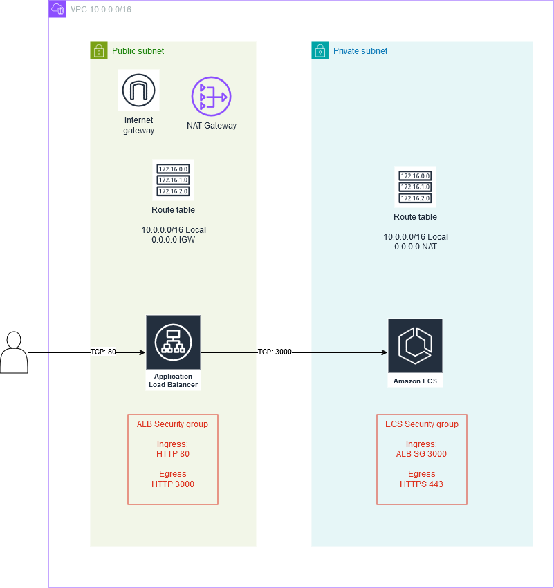

# Example Node.js Project

This is a sample Node.js calculator project and auto deployemnt code in AWS cloud environment using Terraform.

## Table of Contents

- [Build](#build)
- [Installation](#installation)
- [Security](#security)
- [Architecture](#architecture)

## Build

The calculator application is referred from https://github.com/andrewagain/calculator . The source code uses AS IS.

To build and test in local, the application can be built using nodejs. In our example, nodejs 16 used to be compatinble with the packages.

To install the dependencies, run the following command:

```bash
npm install
```

Below command can run the application in local:

```bash
npm start
```

To build the application terraform, aws cli and docker component is required. The build script will create docker image and upload the image to ECR.

AWS profile needs to be created in CLI command. In this project, alpha-access profile name used. Profile had elevated privileges. AWS Account Number needs to be updated in the build and terraform main script.

Below command creates the ECR repository and this is required for uploading the image to ECR.

```bash
cd ./platform
terraform init
terraform apply -target=module.ecr
```

To build the docker image and upload it to ECR, execute build script

```bash
sh ./build.sh
```

For Windows environment

```cmd
build.cmd
```

## Installation

The Terraform code will create network components, application load balancer and ECS service task.

```bash
cd ./platform
terraform init
terraform apply
```

## Security

The code does not use SSL or authentication or DNS. But it is strictly advised to use them.

## Architecture 



